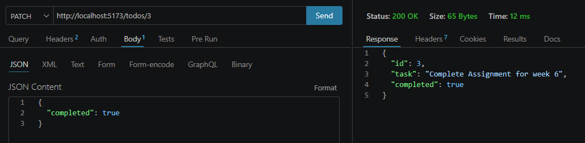
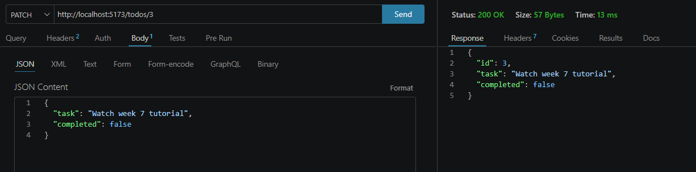
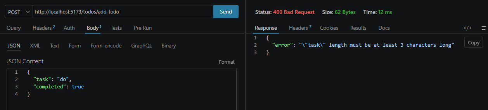
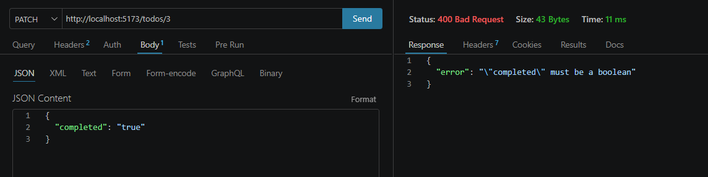

### Installation
- cors
- joi - Used for validating request data.

`npm install cors joi`

### Add Logging Middleware 

Logging middleware was added to log incoming HTTP requests and provide useful information for debugging and monitoring.

### Validation middleware Test

Tested the validation middleware to ensure that incoming request data matches the expected format and data types.

#### PATCH request - `completed` Must Be a Boolean

Tested the PATCH request to ensure that the `completed` field only accepts a boolean value.

#### PATCH request - `task` Is an Optional Field

Tested the PATCH request to ensure that the task field is optional and can be omitted when updating a task.

#### POST request `task` Is required

Tested the POST request to ensure that the `task` field is required when creating a new task.

#### POST request `task` Must Contain at least 3 Characters Long
Tested the PATCH request to ensure that the `task` field must contain at least 3 characters.

#### PATCH request - `completed` Must Be a Boolean

Tested the PATCH request to ensure that the `completed` field does not accept a string value and must be a boolean.

### Render URL

https://crud-todo-api-munirih.onrender.com
